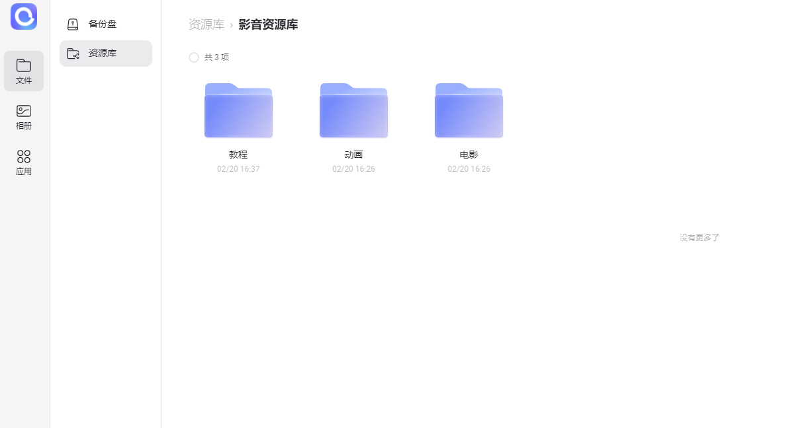
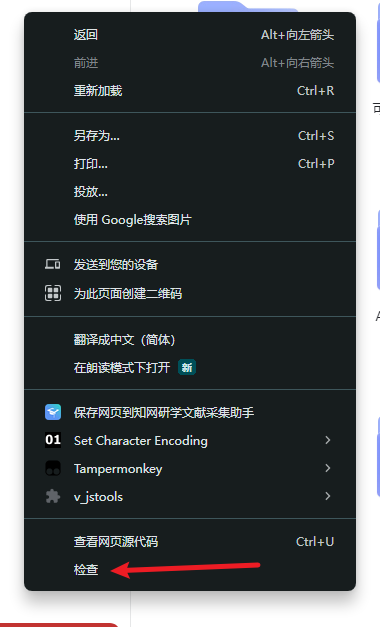
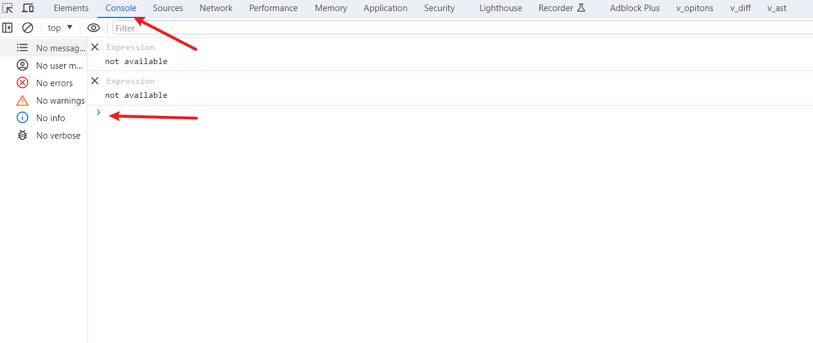
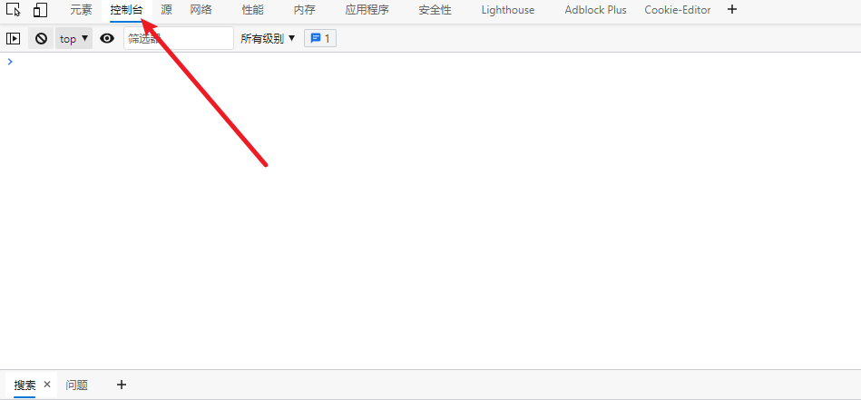
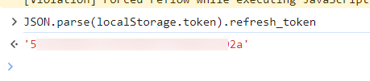
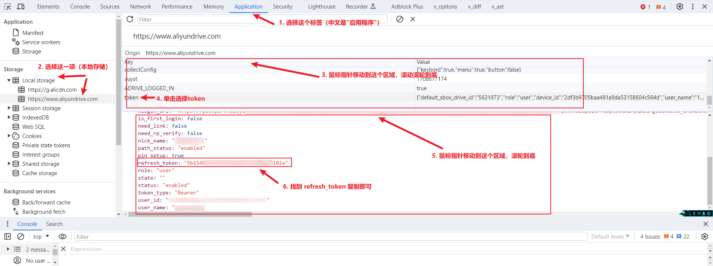
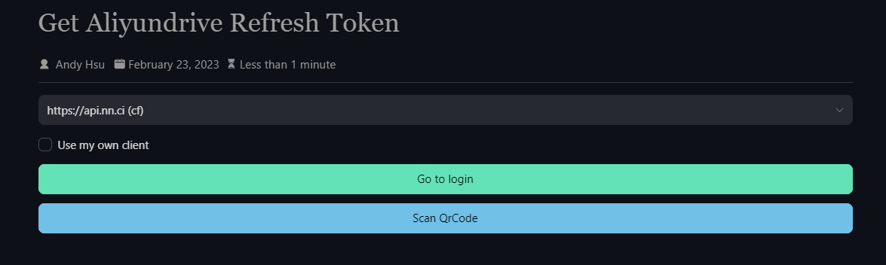
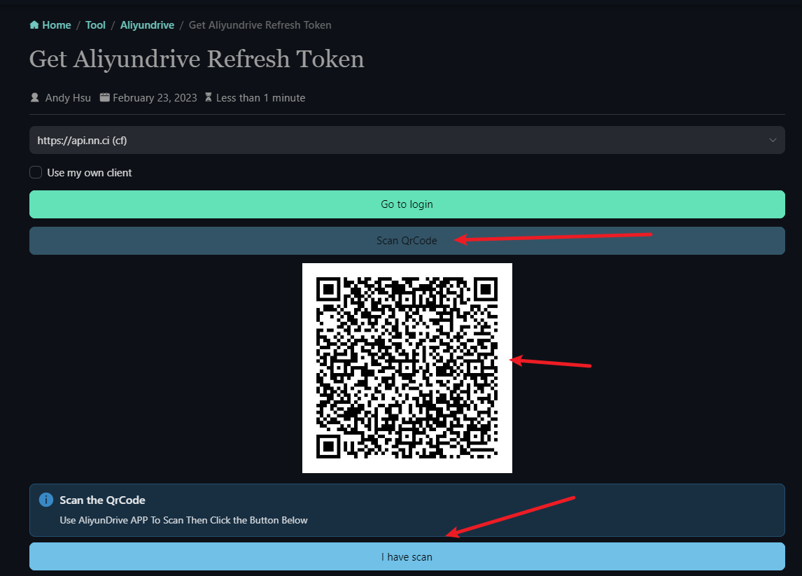

[方式一：开发者工具](#方式一-开发者工具推荐安全)

[方式二: 扫码获取](#方式二扫码获取快速但不太安全)


## 方式一: 开发者工具（推荐：安全）

1. 使用浏览器（chrome/edge）登录阿里云盘



2. 打开`开发者工具`（按F12/右击，再单击`检查`）



3. 选择`控制台`，输入下方语句，并按`Enter`键

```javascript
JSON.parse(localStorage.token).refresh_token
```
`chrom`示例图



`edge`示例图



显示下方内容即可复制



### <font style="color:red">如果控制台输入的语句不生效，则可以按照下图操作</font>




## 方式二：扫码获取（快速，但不太安全）

使用`Alist`提供的扫码功能获取，[前往扫码](https://alist.nn.ci/tool/aliyundrive/request.html)

