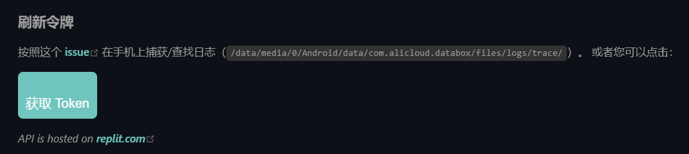
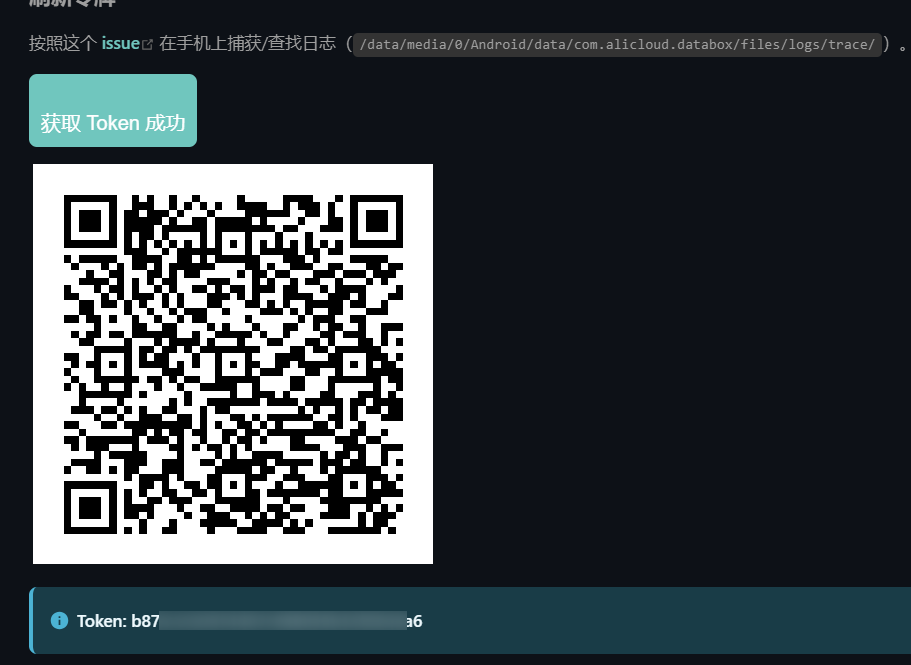

[方式一：开发者工具](#方式一-开发者工具推荐安全)

[方式二: 扫码获取](#方式二扫码获取快速但不太安全)


## 方式一: 开发者工具（推荐：安全）

1. 使用浏览器（chrome/edge）登录阿里云盘


2. 打开`开发者工具`（按F12/右击，再单击`检查`）


3. 选择`控制台`，输入下方语句，并按`Enter`键

```javascript
JSON.parse(localStorage.token).refresh_token
```
`chrom`示例图


`edge`示例图


显示下方内容即可复制


### <font style="color:red">如果控制台输入的语句不生效，则可以按照下图操作</font>


## 方式二：扫码获取（快速，但安全性未知）

使用`Alist`提供的扫码功能获取，[前往扫码](https://alist.nn.ci/zh/guide/drivers/aliyundrive.html#%E5%88%B7%E6%96%B0%E4%BB%A4%E7%89%8C)

点击“获取Token”


使用手机端APP扫码


扫完后，回来再次点击按钮


