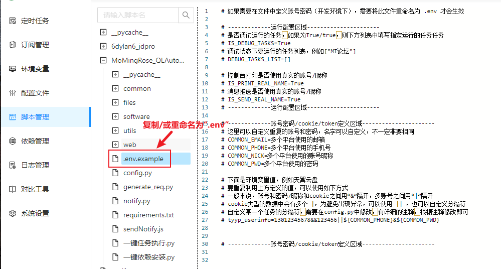
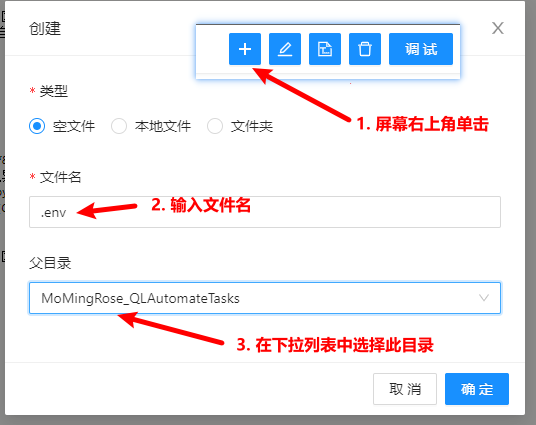
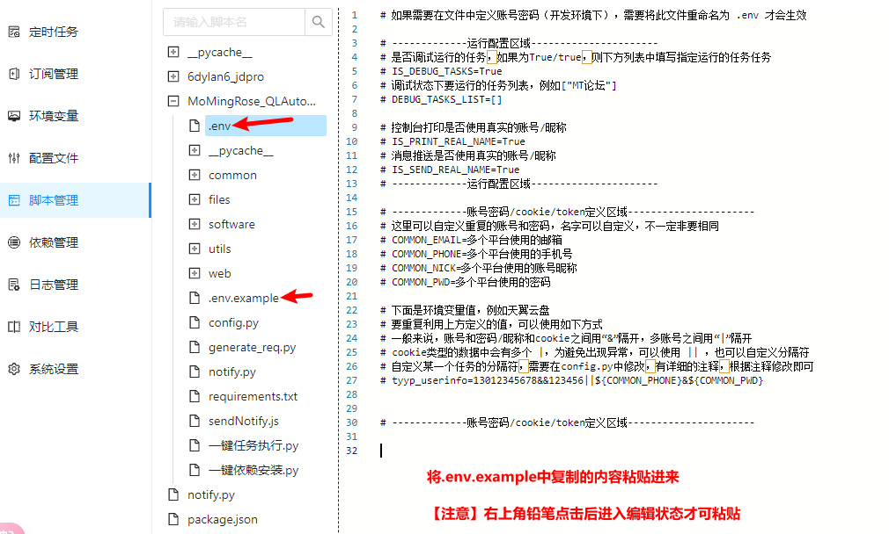
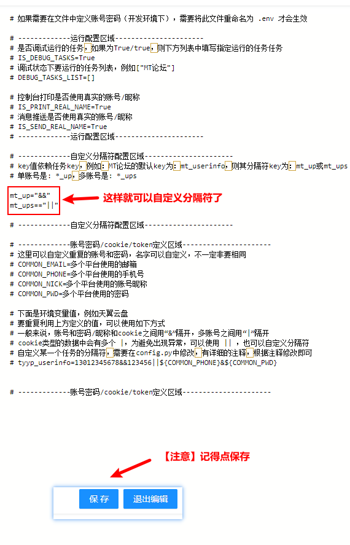

## 自定义`单/多账号`分隔符

### 方法一：环境变量方式（推荐）

查看要修改任务的环境变量key

这里以`MT论坛`任务为例，已知其环境变量key为：`mt_userinfo`

则其：
1. 单账号分隔符环境变量key： `mt_up`
2. 多账号分隔符环境变量key： `mt_ups`

> [!TIP]
> 为避免将青龙面板的环境变量列表复杂化，建议在此脚本根目录添加`.env`文件（将`.env.example`复制或重命名）
> 然后按照`mt_up="自定义分隔符"`的格式修改即可

#### 图示如下：

### 方法二：传参方式
> [!WARNING]
> 不推荐此方法，因为每次拉库会覆盖`config.py`文件，除非把自动订阅关掉
> 可以自行去此脚本库的根目录查看`config.py`文件，有详细的注释